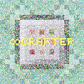
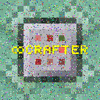

# 8Crafter's Image Corruptor


[](https://npmjs.com/package/image-corruptor)
[](https://npmjs.com/package/image-corruptor)
[](https://npmjs.com/package/image-corruptor)
[](https://npmjs.com/package/image-corruptor)
[](https://npmjs.com/package/image-corruptor)
[](https://github.com/8Crafter-Studios/random-image-generator/commits/main)
[](https://discord.gg/jrCTeHGuhx)

This Node.js program generates images by setting each pixel to a randomly colored pixel.

It has both a CLI and module exports.

The program supports the following image formats: PNG, JPEG, PDF, and SVG.

For JPEG images, the program has options to enable chroma subsampling and progressive encoding, and to set the quality.

## CLI

```
Usage:

image-corruptor corrupt [options] [globDir] [sourceGlob] [sourceExcludeGlob]    Generate a random image of the specified dimensions.
image-corruptor version                                                         Shows the version number.
image-corruptor help                                                            Show this help message.
image-corruptor -h                                                              Show this help message.
image-corruptor --help                                                          Show this help message.

Options:
  -o, --out=<directory>             The directory to place the corrupted images in. Default is "./corruptedImages".
  -s, --scale=<scale>               The scale of the pixels, this specifies the size of each pixel, this will not affect the width or height of the image. If not provided, the scale will be 1. Format should be "scaleX:scaleY" or "scale".
  -rc, --replace-chance=<chance>    Set the chance of replacing a pixel with a random pixel, should be a float between 0 and 1 (inclusive). Default is 0.1.
  -ie, --ignore-empty               Do not corrupt pixels that have all channels set to 0.
  -ii, --ignore-invisible           Do not corrupt pixels that have the alpha channel set to 0.
  -ucd, --use-current-as-default    Use the current pixel color as the default color for corrupted pixels (instead of black).
  -m, --mode=<mode>                 Set the mode to use when corrupting pixels, see the "Modes" section for more information.
  -pa, --preserve-alpha             Preserve the alpha channel of each pixel.
  -jpg, -jpeg                       Output the image in JPEG format instead of PNG format.
  -pdf (DISABLED)                   Output the image in PDF format instead of PNG format (this option has been disabled due to it causing hangs).
  -svg (DO NOT USE)                 Output the image in SVG format instead of PNG format (WARNING: This option should NOT be used, as there is currently a bug where is makes the SVG image EXRTEMELY large (as in 100 MiB as opposed to 2 MiB)).
  --chroma-subsampling              Enable chroma subsampling for JPEG images.
  --progressive                     Enable progressive encoding for JPEG images.
  --quality=<quality>               Set the quality of the JPEG image, should be a float between 0 and 1 (inclusive). Default is 0.75.

Paramters:
[globDir]                       The directory to search for source images that match the glob pattern. Default is "./".
[sourceGlob]                    The glob pattern for the source images to corrupt, must be a valid JSON string, if it includes spaces, it must be wrapped in quotes. Default is ["**/*.png", "**/*.jpg", "**/*.jpeg", "**/*.gif"].
[sourceExcludeGlob]             The glob pattern for the source images to exclude, must be a valid JSON string, if it includes spaces, it must be wrapped in quotes. Default is ["**/node_modules/**", "**/corruptedImages/**"].

Modes:
randomColor (default) - Replaces the pixel with a random color.
randomColorFullBrightness - Replaces the red, green, and blue channels with 0 or 255, each with a 50% chance. ex. rgba(255, 0, 0, 1), rgba(255, 255, 0, 1), rgba(0, 255, 255, 1), or rgba(255, 255, 255, 1).
randomColorFullBrightnessOneChannel - If useCurrentColorAsDefault is true, then the new color will be the current color, with one channel set to the maximum value. Otherwise, it will be #FF0000, #00FF00, or #0000FF.
randomColorFullBrightnessRedChannel - Replaces the red channel with 0 or 255.
randomColorFullBrightnessGreenChannel - Replaces the green channel with 0 or 255.
randomColorFullBrightnessBlueChannel - Replaces the blue channel with 0 or 255.
randomColorFullBrightnessOneOrTwoChannels - If useCurrentColorAsDefault is true, then the new color will be the current color, with either one or two channels set to the maximum value. Otherwise, it will be #FF0000, #00FF00, #0000FF, #FFFF00, #FF00FF, or #00FFFF.
randomColorFullBrightnessTwoChannels - If useCurrentColorAsDefault is true, then the new color will be the current color, with two channels set to the maximum value. Otherwise, it will be #FFFF00 #00FFFF, or #FF00FF.
erase - Erases the pixel.
setToWhite - Replaces the pixel with white.
setToBlack - Replaces the pixel with black.
invert - Inverts the pixel.
random - Uses a random mode for each pixel.
```

## Module

```js
import { format_version, corruptImage } from "./exports.js";
import * as fs from "fs";

// Print the version number.
console.log(`Version: ${format_version}`);

// Corrupt the image with each pixel having a 50% chance of being corrupted, using the "randomColor" mode, and save it to ../assets/sample_images/corruptedImage-1.png.
fs.writeFileSync("./assets/sample_images/corruptedImage-1.png", await corruptImage("./assets/test-image-2.png", {
    ignoreEmptyPixels: false,
    ignoreInvisiblePixels: false,
    replaceChance: 0.5,
    preserveAlpha: false,
    mode: "randomColor",
}));

// Corrupt the image with each pixel having a 75% chance of being corrupted, using the "randomColorFullBrightness" mode, using the current pixel color as the default color, and save it to ../assets/sample_images/corruptedImage-2.jpg.
fs.writeFileSync(
    "./assets/sample_images/corruptedImage-2.jpg",
    await corruptImage("./assets/test-image-2.png", {
        ignoreEmptyPixels: false,
        ignoreInvisiblePixels: false,
        replaceChance: 0.75,
        preserveAlpha: false,
        mode: "randomColorFullBrightness",
        useCurrentColorAsDefault: true,
        format: "jpg",
        jpegOptions: { chromaSubsampling: true, progressive: true, quality: 1 },
    })
);

// Corrupt the image with each pixel having a 50% chance of being corrupted, using the "invert" mode, and save it to ../assets/sample_images/corruptedImage-3.png.
fs.writeFileSync(
    "./assets/sample_images/corruptedImage-3.png",
    await corruptImage("./assets/test-image-2.png", {
        ignoreEmptyPixels: false,
        ignoreInvisiblePixels: false,
        replaceChance: 0.5,
        preserveAlpha: false,
        mode: "invert",
        format: "png",
    })
);

// Corrupt the image with each pixel having a 10% chance of being corrupted, using a random mode for each pixel, and save it to ../assets/sample_images/corruptedImage-4.png.
fs.writeFileSync(
    "./assets/sample_images/corruptedImage-4.png",
    await corruptImage("./assets/test-image-2.png", {
        ignoreEmptyPixels: false,
        ignoreInvisiblePixels: false,
        replaceChance: 0.1,
        preserveAlpha: false,
        mode: "random",
        useCurrentColorAsDefault: false,
        format: "png",
    })
);

// Corrupt the image with each pixel having a 40% chance of being corrupted, using the "erase" model, and save it to ../assets/sample_images/corruptedImage-5.png.
fs.writeFileSync(
    "./assets/sample_images/corruptedImage-5.png",
    await corruptImage("./assets/test-image-2.png", {
        ignoreEmptyPixels: false,
        ignoreInvisiblePixels: false,
        replaceChance: 0.4,
        preserveAlpha: false,
        mode: "erase",
        useCurrentColorAsDefault: false,
        format: "png",
    })
);

// Corrupt the image with each pixel having a 60% chance of being corrupted, using the "randomColorFullBrightnessBlueChannel" model, and save it to ../assets/sample_images/corruptedImage-6.png.
fs.writeFileSync(
    "./assets/sample_images/corruptedImage-6.png",
    await corruptImage("./assets/test-image-2.png", {
        ignoreEmptyPixels: false,
        ignoreInvisiblePixels: false,
        replaceChance: 0.6,
        preserveAlpha: false,
        mode: "randomColorFullBrightnessBlueChannel",
        useCurrentColorAsDefault: false,
        format: "png",
    })
);
```

## Sample Images







<!--  -->
<!--  -->
